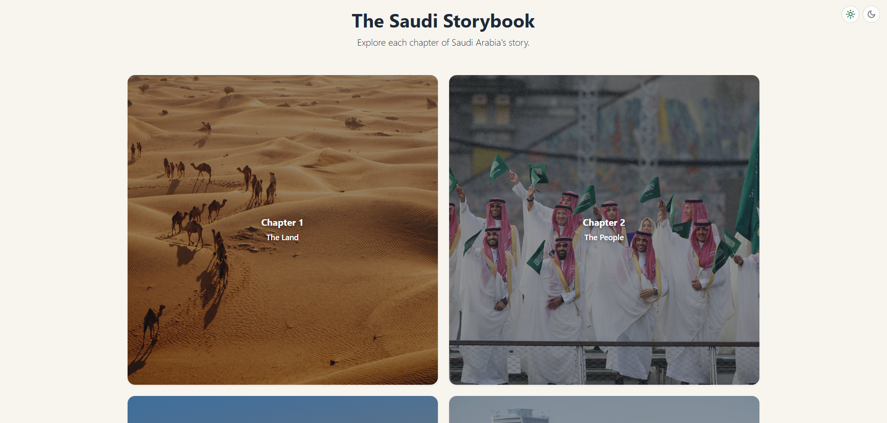
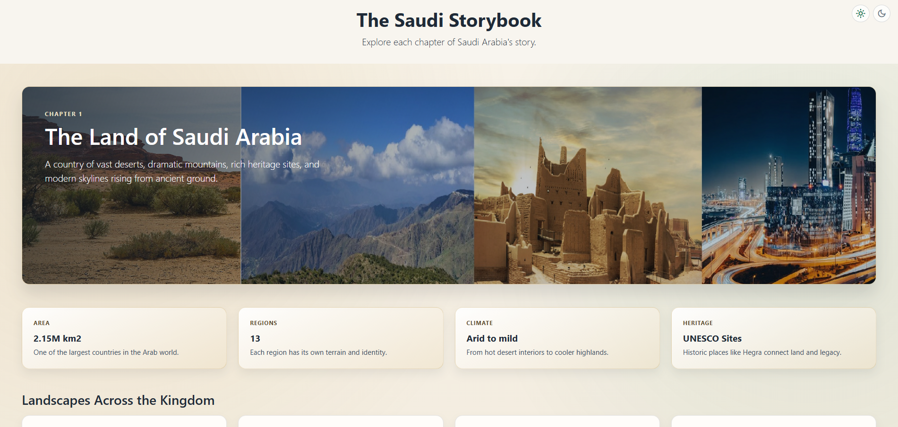

# The Saudi Storybook

The Saudi Storybook is a chapter-based Django project that presents a visual journey through Saudi Arabia. Each chapter focuses on a different theme, from the land and people to traditions, cities, the royal family, the future, legacy, and celebrations.

## Highlights

- Chapter-based storytelling with dedicated pages for each Saudi theme.
- Shared layout and styling for a consistent reading experience.
- Light and dark mode support through a simple cookie-based switch.
- Static image collections organized by chapter.
- Straightforward server-rendered pages with minimal complexity.

## Screenshots





## Key Features

### Story Chapters
- Explore eight curated chapters: land, people, traditions, cities, royal family, future, legacy, and celebrations.
- Navigate each chapter through a dedicated route and template.

### Shared Experience
- Use a common base template to keep navigation and layout consistent.
- Keep the design simple and maintainable with server-rendered Django views.

### Theme Switching
- Switch between light and dark mode with the `mode/<mode>/` route.
- Persist the selected theme in a cookie for a smoother return visit.

### Static Assets
- Organize chapter imagery under `main/static/images/`.
- Keep CSS in one place for easy styling updates.

## Tech Stack

- Python 3.12+ (recommended)
- Django 6.0.3
- SQLite for local development
- Bootstrap 5.3.3 via CDN
- Custom CSS for page styling

Dependencies are listed in [requirements.txt](requirements.txt).

## Getting Started

### Prerequisites

- Python 3.12 or newer
- A virtual environment

### Install

```bash
git clone https://github.com/FadhelAlmalki/the-saudi-storybook.git
cd the-saudi-storybook
python -m venv venv
```

Activate the environment:

Windows (PowerShell):

```powershell
.\venv\Scripts\Activate.ps1
```

Windows (Git Bash):

```bash
source venv/Scripts/activate
```

macOS/Linux:

```bash
source venv/bin/activate
```

Install dependencies:

```bash
pip install -r requirements.txt
```

### Run Locally

```bash
cd TheSaudiStorybook
python manage.py migrate
python manage.py runserver
```

Open the app at:

```text
http://127.0.0.1:8000/
```

## Project Structure

- `main`: app logic, routes, and chapter views.
- `main/templates/main`: base template and chapter pages.
- `main/static/css`: shared styling for the site.
- `main/static/images`: chapter image folders.
- `TheSaudiStorybook`: project settings, root URLs, and ASGI/WSGI entry points.

## Journey Summary

- Visitor journey: open the home page, choose a chapter, and move through the story of Saudi Arabia.
- Reading journey: follow the chapter order or jump directly to a specific theme.
- Theme journey: switch between light and dark mode without losing the current page.

## Routing Map

| Route | View | Purpose |
|---|---|---|
| `/` | `home_view` | Chapter landing page |
| `/land/` | `land_view` | Chapter 1: The Land |
| `/people/` | `people_view` | Chapter 2: The People |
| `/traditions/` | `traditions_view` | Chapter 3: The Traditions |
| `/cities/` | `cities_view` | Chapter 4: The Cities |
| `/royal-family/` | `royal_family_view` | Chapter 5: The Royal Family |
| `/future/` | `future_view` | Chapter 6: The Future |
| `/legacy/` | `legacy_view` | Chapter 7: The Legacy |
| `/celebrations/` | `celebrations_view` | Chapter 8: The Celebrations |
| `/mode/<mode>/` | `mode_view` | Set light/dark mode cookie |
